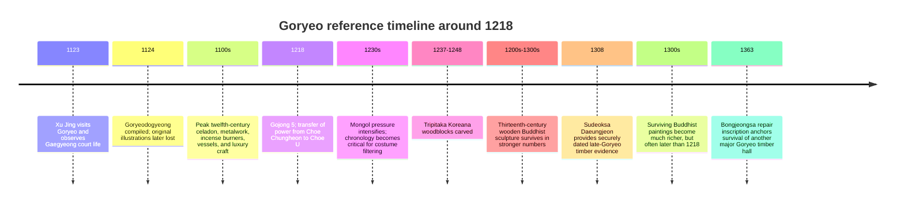
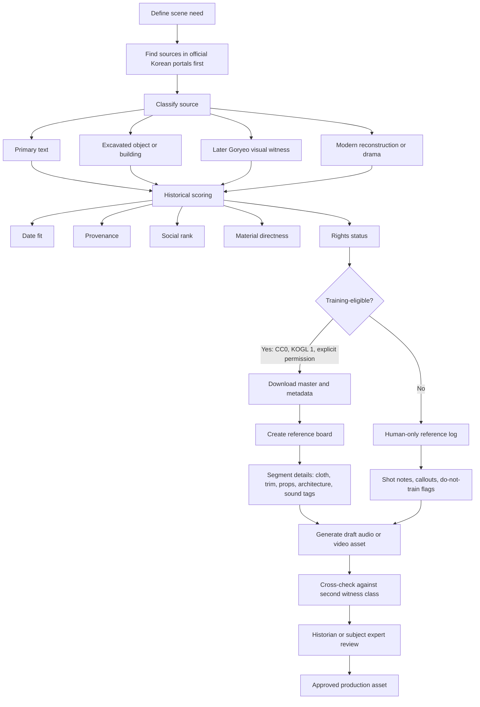

# Reference Corpus for a 1218 Goryeo Screenplay

## Executive summary

This report is tuned to the uploaded screenplay’s early thirteenth-century Goryeo setting, rather than to generic “Korean historical” reference hunting. fileciteturn0file0

For a screenplay set in 1218, the safest reference strategy is **triangulation**, not imitation of a single drama or museum photo set. The evidence closest to the period is uneven: the most important eyewitness account, the 1124 *Goryeodogyeong*, originally contained illustrations, but those drawings were later lost; meanwhile, very few Korean paintings made before the fourteenth century survive. That means accurate reconstruction depends on combining contemporaneous texts, excavated objects and architecture, slightly later but still Goryeo-period visual works, and carefully filtered modern reconstructions. citeturn39search0turn24search16turn13search14turn17search1turn17search2

The strongest **official Korean** stack is this: the entity["organization","National Museum of Korea","museum, seoul, kr"] collection database and special-exhibition materials; the entity["organization","Korea Heritage Service","heritage agency, daejeon, kr"] portal and excavation/report ecosystem; the official text databases around entity["book","Goryeodogyeong","xu jing account"], entity["book","Goryeosa","history of goryeo"], and entity["book","Goryeosajeolyo","essentials of goryeo"]; the entity["organization","National Gugak Center","music institute, seoul, kr"] archive for music and instrument sound; and open-access scholarship in the *Journal of Korean Art and Archaeology*. For **reusable high-resolution stills**, the best legally clean supplements are CC0/public-domain holdings from the entity["organization","Metropolitan Museum of Art","museum, new york, us"], the entity["organization","Cleveland Museum of Art","museum, cleveland, oh, us"], and the entity["organization","Smithsonian's National Museum of Asian Art","museum, washington dc, us"]. citeturn1search2turn1search10turn40search3turn16search0turn27search0turn23search24turn15search1turn15search4turn15search2

For **language and sound**, caution matters even more. No authentic audio from 1218 survives, and the earliest fully attested stage of Korean is Late Middle Korean in the fifteenth and sixteenth centuries; earlier pre-alphabetic stages must largely be reconstructed from fragmentary evidence. So for spoken dialogue, you can build a scholarly **reconstruction brief**, but you cannot honestly treat any public recording as a direct recovery of 1218 speech. By contrast, period-appropriate court and ritual music has a much stronger survival trail through official gugak archives. citeturn12search0turn12search3turn27search0turn8search5turn8search6

Legally, the set of sources that are **good to look at** is much broader than the set that is **safe to ingest into training pipelines**. CC0/public-domain museum collections and clearly marked KOGL/공공누리 Type 1 materials are the cleanest training candidates. The NMK collection is permission-based, many NRICH and Heritage publications are KOGL Type 4 or otherwise restricted, and KBS VOD pages explicitly prohibit unauthorized redistribution and AI learning; DBpia and KISS additionally warn against unauthorized crawling/copying. citeturn15search3turn16search0turn16search1turn16search8turn27search0turn21search5turn32search9turn37search12turn36search5

## Historical frame and source hierarchy

The immediate political context of 1218 is the transition from the regime of entity["people","Choe Chungheon","goryeo military ruler"] to that of entity["people","Choe U","goryeo military ruler"] during the reign of King Gojong. That matters for your screenplay because court protocol, military retinues, private compounds, and the balance between royal and military power should all be read through the lens of a monarchy overshadowed by a hereditary military house. The strongest spatial anchor is entity["point_of_interest","Manwoldae","kaesong, north hwanghae, kp"], understood through archaeology, UNESCO documentation of the former Goryeo capital, the 1123 observations of entity["people","Xu Jing","song envoy"], and the archaeology of extant late-Goryeo timber buildings such as entity["point_of_interest","Buseoksa Muryangsujeon","yeongju, gyeongbuk, kr"], entity["point_of_interest","Sudeoksa Daeungjeon","yesan, chungnam, kr"], and entity["point_of_interest","Bongjeongsa Geungnakjeon","andong, gyeongbuk, kr"]. citeturn22search7turn20search4turn14search0turn39search0turn17search0turn17search5turn17search10

image_group{"layout":"carousel","aspect_ratio":"1:1","query":["Goryeo celadon National Museum of Korea","Buseoksa Muryangsujeon hall","Tripitaka Koreana woodblocks Haeinsa","Goryeo Water-Moon Avalokiteshvara painting"],"num_per_query":1}

For practical production design, the evidence hierarchy should be treated as follows. First come near-contemporary descriptive texts, above all *Goryeodogyeong*, because they describe court dress, ritual implements, boats, gates, palace halls, and urban life from a real embassy visit. Second come excavated or securely dated objects and buildings, because they give you actual forms, materials, tooling marks, and proportions. Third come slightly later Goryeo paintings and sculptures, especially Buddhist paintings, because they often preserve textile structure, jewelry, drapery logic, and elite bodily presentation that textual sources describe only abstractly. Fourth come modern reconstructions—museum CG, documentaries, and historical dramas—which are useful only insofar as they are traceable back to the first three layers. citeturn42search0turn39search0turn17search3turn23search3turn23search22turn20search4

There is one especially important caution for 1218: **do not casually back-project late thirteenth- and fourteenth-century Yuan/Mongol-influenced styles into the earlier Choe U period**. The richer surviving visual material from the late Goryeo court is extraordinarily useful, but some of it reflects later East Asian fashion exchange rather than the exact look of 1218. Use it when it is corroborated by earlier text, archaeology, or object history. citeturn6search2turn6search16turn34search10

## Ranked top 20 resources

1. **entity["organization","National Museum of Korea","museum, seoul, kr"] Collection Database and 3D Data**  
   URL: `https://www.museum.go.kr/ENG/contents/E0402000000.do`  
   This is the best single official Korean resource for **object-level visual truth**: celadon vessels, incense burners, sutra prints, lacquer, metalwork, hair ornaments, boxes, sculpture, and occasionally downloadable 3D models. It is indispensable for props, tabletop culture, surface finish, Buddhist interiors, and elite material culture because many records include zoomable/downloadable images, and selected records expose 3D data. Reliability is extremely high; access is free to search and view, but image reuse is **not open by default** and requires museum permission, so this is primarily a design-reference source unless separately cleared. Search tips: `고려`, `청자`, `수월관음`, `향로`, `나전`, `기와`, `머리꽂이`, `관복`. citeturn1search2turn1search10turn15search3

2. **NMK special exhibition “Goryeo: The Glory of Korea” and guidebook**  
   URL: `https://www.museum.go.kr/site/eng/exhiSpecialTheme/view/specialGallery?exhiSpThemId=319757&listType=gallery`  
   This is the best curator-built **starter map** for the period. It explicitly frames Goryeo as an open, cosmopolitan polity, includes a downloadable guidebook, and organizes 230 paintings, celadons, sculptures, and craftworks into a coherent argument about city life, foreign contacts, Buddhist art, and craft excellence. Use it as your first-pass syllabus and moodboard scaffold before you descend into object-level searching. Search tips: use the guidebook, then branch from object names in Korean. citeturn39search0turn24search10

3. **entity["organization","Korea Heritage Service","heritage agency, daejeon, kr"] National Heritage Portal**  
   URL: `https://www.heritage.go.kr/`  
   This is the core official government portal for designated heritage, and it is exceptionally useful because it lets you search by **period**, **media type**, and often **KOGL status**. For a screenplay, it is strongest on architecture, site photographs, plans, state designations, and heritage explanations for key buildings, temple sites, fortifications, and movable cultural properties. Access is free; licensing is mixed and must be checked item by item. Search tips: set `시대=고려시대`, then narrow by `사진`, `동영상`, or `도면`; search `무량수전`, `대웅전`, `만월대`, `고려목판`, `분묘`. citeturn40search3turn40search7turn17search5turn17search3

4. **entity["organization","National Research Institute of Cultural Heritage","research institute, daejeon, kr"] Knowledge Portal and report corpus**  
   URL: `https://portal.nrich.go.kr/`  
   If the Heritage Portal tells you **what** matters, NRICH tells you **what it looked like on the ground**. Its excavation volumes and research reports on Goryeo tombs, fortresses, temple sites, and specific finds are crucial for architecture, floorplans, construction details, sitemaps, finds distribution, and archaeological reconstructions. Access is free; rights are clearer than on many Korean sites because NRICH explains KOGL categories, but many major reports are still KOGL Type 4 while some individual image files are Type 1—so check each file, not just the portal. Search tips: `고려시대 분묘유적 자료집`, `고려시대 성곽유적 자료집`, `만월대`, `고려 사지`, `기와`, `목조건축`. citeturn16search0turn16search2turn16search8turn16search6

5. **The *Goryeodogyeong* corpus**  
   URLs: `https://www.itkc.or.kr/` and `https://uhpress.hawaii.edu/title/a-chinese-traveler-in-medieval-korea-xu-jings-illustrated-account-of-the-xuanhe-embassy-to-koryo/`  
   For a 1218 screenplay, this is the single most important near-contemporary descriptive source. Xu Jing’s 1123 diplomatic visit yielded detailed descriptions of cities, gates, palace halls, official dress, ceremonial attributes, and customs; even though the original drawings are lost, the textual witness remains foundational. Use it for court routine, diplomacy, ritual implements, urban sequence, and foreign perception of Goryeo. Korean/classical access is through Korean classics databases; the annotated English translation from the Korean Classics Library is the best bridge for non-Korean-reading collaborators. Search tips: `선화봉사고려도경 관복`, `의물`, `궁전`, `도성`, `범선`, `예성강`. citeturn42search0turn39search0turn24search16

6. **entity["organization","National Institute of Korean History","history institute, gwacheon, kr"] historical databases around *Goryeosa* and *Goryeosajeolyo***  
   URLs: `https://db.history.go.kr/` and `https://www.history.go.kr/en/main/main.do`  
   This is the best official Korean source for **chronology, offices, political events, court ritual references, biographies, and image/video teaching resources**. For your specific date, it is where you verify reign-year details, office titles, royal orders, faction movement, and the military-regime context. It also hosts image and educational video resources through “Our History Net,” which are useful for controlled, conservative historical explanations of palace, painting, and craft topics. Search tips: `고종 5년`, `최우`, `최충헌`, `팔관회`, `의물`, `개경`, `만월대`, `고려불화`. citeturn33search7turn22search7turn33search20turn33search10

7. **Open-access scholarship in the *Journal of Korean Art and Archaeology***  
   URL: `https://www.ijkaa.org/`  
   This is the most useful open-access English-language scholarly journal for production design on Goryeo art. The best articles for your purposes include “Clothing and Textiles Depicted in Goryeo Paintings of Water-moon Avalokitesvara,” “The Formation of the Bokjang Ritual during the Goryeo Dynasty,” and “Thirteenth-century Wooden Sculptures of Amitabha Buddha in the Late-Goryeo Period.” Use JKAA for argument-driven reading that connects object form, ritual use, textile logic, and social context. Access is free to read/download; reuse rights should still be checked per article. Search tips: `Goryeo painting`, `Water-moon Avalokitesvara`, `Bokjang`, `wooden sculpture`, `craftwork`. citeturn23search24turn23search6turn23search21turn23search22

8. **Costume and hairstyle study cluster**  
   Representative URLs: `https://www.ijkaa.org/v.14/0/73/29`, `https://www.dbpia.co.kr/journal/detail?nodeId=T13394908`, `https://www.kci.go.kr/`, `https://koreascience.kr/`  
   If you want clothing and hair that read as historically literate rather than “generic sageuk,” this cluster is essential. Start with the JKAA article on clothing and textiles in Goryeo paintings, then add Korean-language papers on costume shape, hairstyle reconstruction, and Yuan-influence chronology; this will help you separate plausible 1218 silhouettes from later fourteenth-century court fashion. Accessibility is mixed: JKAA is open, while DBpia/KCI/KoreaScience coverage varies by article. Search tips: `고려 불화 복식`, `고려 복식 연구`, `고려 머리모양`, `원 영향기`, `수월관음 복식`. citeturn23search3turn6search4turn34search10turn34search7turn34search9

9. **entity["organization","National Gugak Center","music institute, seoul, kr"] Gugak Archive**  
   URL: `https://archive.gugak.go.kr/`  
   This is the strongest official Korean corpus for **surviving traditional music, instrument sound, and performance video**. For a Goryeo-era project, it is especially valuable for court-music continuities, instrument histories, notated/recorded pieces such as `낙양춘` and `동동`, and even 3D/VR instrument records. Access is generous for streaming, but downloads often require login/request and the applicable KOGL category must be checked. Search tips: `아악`, `향악`, `당악`, `동동`, `낙양춘`, `당피리`, `공공누리`. citeturn27search0turn8search5turn8search6turn8search3

10. **entity["organization","National Hangeul Museum","museum, seoul, kr"] archive plus historical phonology stack**  
    URLs: `https://archives.hangeul.go.kr/` and `https://www.hangeul.go.kr/`  
    This is not a 1218 speech archive—nothing like that exists—but it is still the safest official Korean entry point for understanding how later premodern Korean sound was analyzed, taught, and archived. Pair the museum archive with serious historical-phonology reading, especially discussions of Late Middle Korean and the fact that earlier pre-alphabetic Korean must be reconstructed from fragmentary evidence. Use it to brief a linguist or dialogue coach, not to pretend that any public recording is a direct 1218 pronunciation source. Search tips: `중세국어`, `훈민정음`, `국어사`, `구술 채록`, `음운사`. citeturn29search3turn10search2turn12search0turn12search3

11. **entity["organization","Academy of Korean Studies","research academy, seongnam, kr"] EncyKorea and KOSTMA**  
    URLs: `https://encykorea.aks.ac.kr/` and `https://kostma.aks.ac.kr/eng/`  
    These are outstanding for **terminology control**. When your art department needs to know the difference between an official belt type, a ritual robe category, a headgear term, or a textual witness, AKS resources usually get you there fast. The encyclopedia is especially valuable for Korean clothing and ceremony vocabulary; KOSTMA provides translations and gateways into classical sources. Access is free to read, but media licensing is conservative and must be checked closely. Search tips: `백관복`, `제복`, `품대`, `각대`, `의물`, `팔관회`. citeturn25search10turn26search1turn26search3turn26search6

12. **entity["organization","University of Hawai'i Press","publisher, honolulu, us"] English translation stack**  
    URL: `https://uhpress.hawaii.edu/bookseries/korean-classics-library-historical-materials/`  
    This is the best English bridge for collaborators who cannot work directly from Korean and classical Chinese. The key books are *A Chinese Traveler in Medieval Korea* for Xu Jing’s 1123 account, and the new *Koryŏsa* translation volumes covering 918–1170, with additional volumes continuing the annals. These are purchase items, not open-access datasets, but for writers, production designers, and dialect coaches they are so useful that they belong in any serious research stack. citeturn42search0turn42search1turn25search1turn25search4

13. **RISS**  
    URL: `https://www.riss4u.net/`  
    RISS is the broadest practical Korean academic **discovery layer** for theses, dissertations, journal articles, and cross-links into provider databases. It is where you broaden from exact object names and official-site vocabulary into academic debates on clothing, architecture, archaeology, music history, and historical linguistics. Treat it as a search and bibliography tool first; full text is mixed and depends on source/provider. Search tips: start with `원문 있음`, then try `고려 복식`, `만월대`, `고려 불화`, `고려시대 음악`, `중세국어`. citeturn35search6turn35search2turn35search3

14. **DBpia**  
    URL: `https://www.dbpia.co.kr/`  
    DBpia is the most useful subscription platform for Korean humanities articles once you already know what to look for. It is especially good for costume studies, visual-culture studies, archaeology-adjacent design papers, and art-history journals. Institution authentication is the default access route; unauthorized crawling is prohibited. Search tips: `고려 머리모양`, `고려 남자 복식`, `고려 불화 의상`, `만월대`, `경번갑`. citeturn37search1turn37search2turn37search3turn37search12turn37search13

15. **KISS**  
    URL: `https://kiss.kstudy.com/`  
    KISS is another major Korean full-text journal platform and is often the easiest place to locate journal articles in Korean studies, art history, and costume history. It is important not because it is more authoritative than official heritage sources, but because it lets you rapidly gather secondary discussions, including papers that test how dramas represent earlier costume and armor. Access is subscription/institution based; the site warns against unauthorized crawling/copying. Search tips: `고려 복식`, `고려 머리모양`, `고려 사극 고증`, `원 영향`, `무인시대`. citeturn36search1turn36search5turn36search3

16. **entity["organization","UNESCO","intl agency, paris, fr"] pages on the Goryeo capital and the Tripitaka**  
    URLs: `https://whc.unesco.org/en/list/1278/` and `https://www.unesco.org/en/memory-world/printing-woodblocks-tripitaka-koreana-and-miscellaneous-buddhist-scriptures`  
    UNESCO is not where you go for stitching or small props, but it is where you go for **macro-layout and site hierarchy**. The Kaesong inscription page clarifies the monumental logic of the former capital, while the Tripitaka documentation gives an official frame for thirteenth-century Buddhist production and the long survival of Goryeo woodblock culture. Use these pages to orient site geography and the political-religious scale of the world your story inhabits. citeturn14search0turn14search1turn14search3turn14search18

17. **entity["organization","Metropolitan Museum of Art","museum, new york, us"] Open Access Korean collection**  
    URL: `https://www.metmuseum.org/art/collection`  
    The Met is one of your best legally clean still-image corpora. Its Goryeo holdings include Buddhist paintings, hair ornaments, utensils, and ceramics, and public-domain works are available through the museum’s CC0 Open Access policy. The collection skews toward elite and religious material rather than everyday life, but for cloth, jewelry, and sacred interior color this is first-rate. Search tips: `Goryeo`, `Water-Moon Avalokiteshvara`, `hair pin`, `Amitabha`, `celadon`. citeturn13search14turn13search17turn15search1turn15search17

18. **entity["organization","Cleveland Museum of Art","museum, cleveland, oh, us"] Open Access Korean collection**  
    URL: `https://www.clevelandart.org/open-access`  
    Cleveland is arguably the best open-access corpus for **Goryeo celadon and practical vessels**. It also includes useful tomb and burial objects, spoon forms, nail covers, bottles, bowls, and dishes that help depopularize “museum-masterpiece bias” and make your material world feel inhabited. Its image/data program is CC0. Search tips: `Goryeo`, `celadon`, `spoon`, `bottle`, `burial objects`. citeturn13search1turn13search5turn13search9turn15search4turn15search20

19. **entity["organization","Smithsonian's National Museum of Asian Art","museum, washington dc, us"] Korean collection and publications**  
    URL: `https://asia.si.edu/explore-art-culture/collections/search/`  
    The Smithsonian’s Korean holdings are especially valuable for Goryeo Buddhist painting, and many objects are marked public domain/CC0. The museum also hosts free research publications, including *Ars Orientalis* material related to Goryeo Buddhist painting. This makes it unusually powerful as a source that combines high-resolution image access with scholarly interpretation. Search tips: `Goryeo`, `Water-Moon Avalokiteshvara`, `Buddha Amitabha`, `Ars Orientalis Goryeo`. citeturn13search7turn13search19turn13search16turn15search2

20. **entity["organization","KBS","broadcaster, seoul, kr"] historical screen-reference package**  
    URLs: `https://program.kbs.co.kr/1tv/drama/mooin/pc/index.html`, `https://program.kbs.co.kr/1tv/drama/jeongdojeon/pc/index.html`, `https://vod.kbs.co.kr/`  
    Use this package as **analyst-only visual reference**, not as an ingestible training set unless you separately clear rights. entity["tv_show","The Age of Warriors","kbs drama 2003"] is the best major-screen period match because it covers the military regime up to Choe U, and late episodes 150–158 explicitly stage Gojong, Choe U, and succession politics near your date. entity["tv_show","Jeong Do-jeon","kbs drama 2014"] is later in chronology but valuable for late-Goryeo Gaegyeong skyline, armored troops, and court blocking; contemporary criticism noted that its city CG echoed KBS historical reconstructions rooted in *Goryeodogyeong* and excavated evidence. Pair both with KBS History Special / Manwoldae documentary clips for documentary-style palace geometry. KBS VOD pages explicitly state that unauthorized redistribution and AI learning are prohibited. citeturn21search0turn22search0turn22search1turn32search1turn32search4turn32search7turn20search4turn20search10turn21search5turn32search9

## Comparison table

| Rank | Resource | Best media | Resolution or quality | Language | Access cost | Licensing posture |
|---|---|---|---|---|---|---|
| 1 | NMK Collection DB citeturn1search2turn1search10turn15search3 | Still image, selected 3D | Zoom/download; selected 3D | KO/EN | Free | Permission required for reuse |
| 2 | NMK Goryeo exhibition citeturn39search0turn24search10 | Still image, catalogue PDF | Curated exhibition photography; guidebook | KO/EN | Free | Reference use; check museum terms |
| 3 | Heritage Portal citeturn40search3turn40search7 | Still image, moving image, plans | Mixed; often strong site photos/drawings | KO, some EN | Free | Mixed; check KOGL/item page |
| 4 | NRICH portal citeturn16search0turn16search2turn16search8turn16search6 | Still image, report PDFs, plans | Excellent for excavation detail | KO | Free | Mixed KOGL; many reports restricted, some images Type 1 |
| 5 | *Goryeodogyeong* corpus citeturn42search0turn39search0turn24search16 | Text | Primary-source descriptive detail | Classical Chinese, KO, EN | Mixed; free portals + paid translation | Text/reference use |
| 6 | NIKH historical DB citeturn33search7turn22search7turn33search20 | Text, still image, educational video | Strong chronology and curated image/video | KO/EN site layers | Free | Varies by item |
| 7 | JKAA citeturn23search24turn23search6turn23search21turn23search22 | Text, article images | High scholarly quality; downloadable PDFs | EN | Free | Read/download; reuse check per article |
| 8 | Costume/hair paper cluster citeturn23search3turn6search4turn34search10turn34search7 | Text, diagrams, figure plates | Strong analytic value; mixed image quality | KO/EN | Mixed | Mixed by platform/article |
| 9 | Gugak Archive citeturn27search0turn8search5turn8search6 | Audio, moving image, 3D instrument views | Broadcast/archive quality | KO | Free streaming; login/request for downloads | KOGL varies by item |
| 10 | Hangeul Museum + phonology stack citeturn29search3turn10search2turn12search0turn12search3 | Text, museum archive, educational media | Strong for method, not period-authentic audio | KO/EN mix | Free | Mostly reference/educational use |
| 11 | AKS EncyKorea/KOSTMA citeturn25search10turn26search1turn26search3 | Text, limited media | Excellent controlled vocabulary | KO, some EN | Free | Media rights conservative; check item |
| 12 | UH Press translations citeturn42search1turn25search1turn25search4 | Books | High-quality annotated translations | EN | Purchase | Standard book copyright |
| 13 | RISS citeturn35search6turn35search2turn35search3 | Text discovery | Excellent search/bibliography layer | KO | Mixed | Provider-dependent |
| 14 | DBpia citeturn37search1turn37search2turn37search12 | Full-text articles | High for humanities journals | KO/EN UI | Subscription/institution | No unauthorized crawling/copying |
| 15 | KISS citeturn36search1turn36search5 | Full-text articles | High for Korean journals | KO/EN UI | Subscription/institution | No unauthorized crawling/copying |
| 16 | UNESCO Kaesong/Tripitaka citeturn14search0turn14search1turn14search18 | Site summaries, gallery, maps | Good macro-site documentation | EN | Free | Mixed image rights |
| 17 | The Met OA citeturn13search14turn15search1turn15search17 | Still image | High-resolution public-domain images | EN | Free | CC0/public domain |
| 18 | Cleveland OA citeturn13search5turn15search4turn15search20 | Still image, dataset | High-resolution images/data | EN | Free | CC0 |
| 19 | Smithsonian NMAA citeturn13search19turn13search16turn15search2 | Still image, scholarly publications | High-quality images; good research overlay | EN | Free | Many items CC0/public domain; check object |
| 20 | KBS screen package citeturn21search0turn32search4turn20search10turn21search5turn32search9 | Moving image | TV/streaming quality; some full VOD behind platform access | KO | Free previews; platform access for full VOD | Copyrighted; AI learning prohibited on VOD pages |

## Search vocabulary and archive queries

The Korean portals above are far more productive in **Korean-language search** than in English, and several of them let you filter by period, media type, and KOGL status. In practice, you should search in Korean first, then switch to English only when you are checking translation layers or international holdings. citeturn40search3turn40search7turn27search0turn33search20

For clothing, hair, and bodily presentation, the most useful Korean terms are `고려 복식`, `고려 관복`, `고려 평복`, `고려 머리모양`, `고려 불화 복식`, `수월관음 복식`, `관모`, `품대`, `각대`, and `경번갑`. For interiors and architecture, use `개성 만월대`, `고려 궁궐`, `회경전`, `고려 사지`, `무량수전`, `대웅전`, `기와`, `주심포`, `분묘유적`, and `성곽유적`. For ritual and music, use `팔관회`, `연등회`, `의물`, `아악`, `향악`, `당악`, `동동`, `낙양춘`, `당피리`, and `취타`. For language and pronunciation, use `중세국어`, `국어사`, `역사음운론`, `한자음`, and `구결`. For trade and foreign contact, use `예성강`, `벽란도`, `개경 국제도시`, `송 사신`, and `고려도경`. citeturn39search0turn8search3turn12search0

Sample archive-targeted queries that usually return better results than generic Google-style browsing are:

```text
site:museum.go.kr 고려 청자 향로
site:museum.go.kr 수월관음 고려 불화
site:heritage.go.kr 만월대 고려시대 도면
site:portal.nrich.go.kr 고려시대 성곽유적 자료집
site:portal.nrich.go.kr 고려시대 분묘유적 자료집
site:db.history.go.kr 고려사 팔관회
site:db.history.go.kr 고종 5년 최우
site:archive.gugak.go.kr 낙양춘 공공누리
site:archive.gugak.go.kr 동동 정악보
site:encykorea.aks.ac.kr 백관복 품대 각대
site:uhpress.hawaii.edu Xu Jing Koryo
```

If you need to find visual references for **specific screenplay motifs**, pair a noun with a source layer. Examples: `고려 관복 site:db.history.go.kr`, `고려 향로 site:museum.go.kr`, `만월대 site:portal.nrich.go.kr`, `고려 불화 복식 site:ijkaa.org`, `동동 site:archive.gugak.go.kr`. That simple pairing usually outperforms broad natural-language searching.

## Verification and extraction workflow

For historical verification, the most reliable rule is to require at least **two independent witness classes** before an element enters your final design bible. A robe shape seen only in a late painting is not enough; a belt type known from both text and object is much stronger; a palace interior shown in a drama but unsupported by archaeology should remain provisional. Because *Goryeodogyeong* lost its drawings and because pre-fourteenth-century Korean paintings are so sparse, overconfidence from a single visual source is the biggest failure mode in Goryeo production research. citeturn24search16turn13search14turn20search4

The easiest way to operationalize that is to score every reference on five axes: **date fit**, **provenance**, **social rank**, **material directness**, and **rights status**. Date fit means asking whether the source is near 1218 or belongs to later Goryeo; provenance means whether an item is securely tied to Goryeo rather than being merely “Korean-looking”; social rank means distinguishing royal, aristocratic, monastic, military, and common settings; material directness means preferring excavated objects and extant buildings over later stylization; rights status means separating view-only references from ingestible training material. This is especially important for late Goryeo court fashion, where later Yuan/Mongol influence can distort a 1218 reconstruction if you do not label chronology explicitly. citeturn6search2turn6search16turn34search10turn22search7

For AI-related extraction, the cleanest workflow is to build **two separate corpora**. The first is a **reference-viewing corpus** that may include restricted material such as KBS scenes, paywalled articles, and permission-only museum pages; use that corpus only for human note-taking, shot logging, prop sketching, and verbal style guides. The second is a **training-eligible corpus** limited to CC0/public-domain museum images, KOGL Type 1 items, self-made photographs/field recordings, and materials you have explicit written permission to reuse. KBS explicitly prohibits AI learning on its VOD pages, while DBpia and KISS bar unauthorized crawling/copying; those belong in the first corpus, not the second. citeturn21search5turn32search9turn37search12turn36search5turn15search1turn15search4turn15search2turn16search6turn27search0

For still-image extraction, download the highest lawful-resolution master, preserve the original filename and source URL, and attach structured metadata: date range, source class, object type, material, findspot or holding institution, social setting, confidence score, and license. Then derive three working outputs from the same master: a **clean reference image**, a **segmented details board** for trim/pattern/hardware, and a **text annotation card** summarizing what is solid versus conjectural. This matters because diffusion/video systems are much easier to steer with mixed visual-plus-text exemplars than with raw image dumps alone.

For moving-image extraction, only extract frames from material you have the right to process. Where rights are restrictive but the scene is useful, make a **manual shot log** instead: scene ID, episode timestamp, what is reliable, what is dramatized, and what must be cross-checked. This preserves the historical value of a scene without converting a copyrighted episode into a de facto training set.

For audio, divide the problem into **music**, **speech**, and **ambience**. Music can come from the Gugak Archive and related official corpora. Speech should be built from a linguist-facing brief anchored in historical phonology, with explicit notes on what is certain, inferred, and purely performative; the earliest fully attested Korean is later than your setting, so your output should be labeled “reconstructed for 1218” rather than “authentic 1218 Korean.” Ambience is best built through lawful field recording and foley: record preserved wooden halls, temple courtyards, bells, footsteps on packed earth, horse tack, paper doors, wind through eaves, and ceramic/metal handling at analogous heritage sites, then layer them with instrument and crowd beds rather than trying to find a nonexistent “Goryeo ambience archive.” citeturn27search0turn12search0turn12search3

## Visual aids

The timeline below shows which visual and textual witnesses matter most around 1218, and where the survivorship gaps begin to distort reconstruction. The key takeaway is that the best evidence cluster sits **just before and just after** your exact date, not exactly on it. citeturn42search0turn39search0turn22search7turn14search1turn17search5turn13search14



The workflow below is the one I would use to turn the source stack into AI-ready design material without collapsing historical rigor into style scraping.

